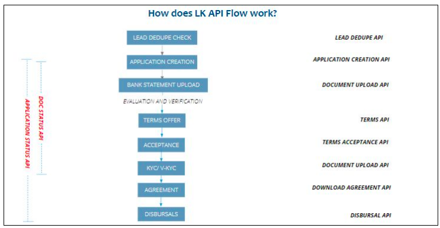

# Indroduction

Welcome to Lendingkart Partner API documentation. This documentation provides access to the end to end .Lendingkart Partner API suite. Integrate our APIs quickly to enable Lendingkart loan journey in your platforms to
provide a unique experience to your customers.

## Onboarding Process
Please reach out to your SPOC from the Lendingkart Partnerships team to get your UAT API Key.

## Sourcing Guidelines:
Please refer to the below link for basic Lendingkart application sourcing guidelines(Negative Industries and
Negative pin codes mentioned here). We recommend that you source leads based on these criteria to ensure
lower rejection rates by filtering the leads upfront at your end.
[link](https://docs.google.com/spreadsheets/d/1_GxM3sZeuhTE-oKFN0HYKDz4LHMj-k5FD22b80CCf0I/edit?usp=sha
ring)

## Swagger link
[click here for swagger link](https://lkext.lendingkart.com/apidoc/home.html#!/Partner_Controller/)

## Support
Please mail us at help.partnerDB@lendingkart.com incase you have any queries on API Documentation. Our
team will respond to your queries within 24 hours.
##API Integration Process
Production API key will be provided after the integration process is approved in UAT flow by Lendingkart Product
team.

## Partner Dashboard - Tracking
All Applications pushed to Lendingkart using Application creation API will be available in your partner dashboard
for live tracking. Please request Partner Dashboard login credentials from your SPOC from Lendingkart
Partnerships team in case you haven’t yet received login credentials.

[Tutorial Video](https://www.youtube.com/watch?v=kCl6ZmkL4A8&feature=youtu.be)
